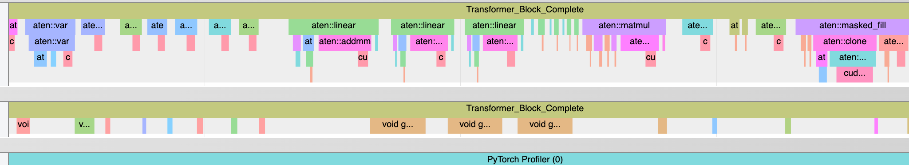
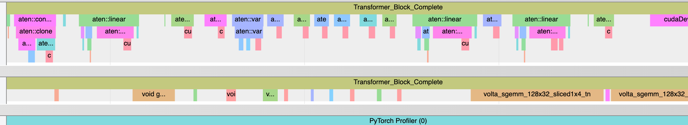
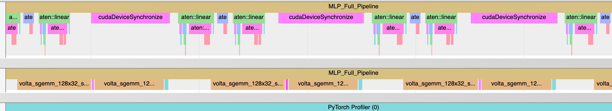

# Beating PyTorch: Optimizing GPT-2 Small Inference Through Custom CUDA Kernels on NVIDIA T4 GPUs

This repository contains the full implementation, profiling workflow, and optimization experiments for the project.

Our goal was to identify performance bottlenecks in GPT-2 inference and design CUDA-level optimizations tailored specifically for the **NVIDIA T4 GPU**, a commonly accessible but bandwidth-limited GPU used in Colab and Kaggle environments.


## Project Description

GPT-2 small (124M parameters) is widely used, but its default PyTorch inference path is not optimized for older GPUs like the T4, which lacks the high bandwidth and advanced tensor-core instructions available in A100/H100 hardware. Many modern kernels (e.g., FlashAttention) cannot be used directly due to architecture incompatibilities. 

To address this, our project:

* Performed **layer-level and kernel-level profiling** of GPT-2 inference
* Identified the true bottlenecks:
  * Memory-bound QKV projections
  * Excess kernel-launch overhead in attention
  * GEMM-dominated MLP layers
* Implemented optimization strategies such as:
  * FP16/BF16 Tensor Core acceleration
  * Custom fused CUDA kernels
  * Reduced precision to lower memory traffic
  * Cutlass-based fused layers
* Analyzed why FlashAttention cannot be efficiently used on T4 GPUs
* Built a reproducible benchmarking and profiling pipeline

This repository focuses on system-level optimization, low-level GPU kernel design, and hardware-aware reasoning rather than model accuracy improvements.


## Project Milestones & Completion Status

| Milestone                                            | Description                                                                    | Status                                                                            |
| ---------------------------------------------------- | ------------------------------------------------------------------------------ | --------------------------------------------------------------------------------  |
| **1. Implement GPT-2 small from scratch in PyTorch** | Recreated GPT-2 architecture + loaded pretrained weights for correct inference | Completed                                                                         |
| **2. Layer-level profiling**                         | Profiling across Transformer blocks, attention, MLP, layer norms               | Completed                                                                         |
| **3. Kernel-level profiling**                        | Analyzed cuBLAS kernels, softmax kernels, elementwise kernels                  | Completed                                                                         |
| **4. Identify optimization opportunities**           | Classified ops (GEMM, reductions, elementwise), mapped bottlenecks             | Completed                                                                         |
| **5. Implement fused optimizations**                 | FP16 kernels, fused attention attempts, fused MLP ops                          | Implemented but limited gains on T4 due to hardware constraints                   |
| **6. FlashAttention investigation on T4**            | Studied algorithm + attempted adaptation                                       | Implemented, but FlashAttention is not practically compatible with T4 GPUs        |
| **7. Benchmarking & reproducible experiments**       | Timing, throughput tables, charts                                              | Completed                                                                         |


## Repository Structure

```
beating-pytorch/
│
├── checkpoints/
│   ├── Beating PyTorch Midpoint.pdf
│   └── Beating PyTorch.pdf
│
├── results/
│   ├── mlp_full_pipeline_trace.json
│   └── transformer_block_complete_trace.json
|
├── scripts/
│   ├── Cuda_kernel_profiling.py
│   ├── GPT2_124M_model_code.py
│   ├── GPT2_layer_profiler.py
│   ├── HPML_final_project.ipynb
│   ├── Stable_gpt2_chrome_trace.py
│   └── utils.py
│
└── README.md
```

## Example Commands to Run Code
- Install deps: `python -m pip install -r requirements.txt`
- Basic GPT-2 inference: `python GPT2_124M_model_code.py --prompt "Hello from HPC" --max_new_tokens 50`
- Layer-level profiling (console report only): `python -m GPT2_layer_profiler`
- CUDA/kernel profiling with Chrome trace (saves gpt2_detailed_trace.json): `python -m Cuda_kernel_profiling`
- Stable Chrome trace run (saves `gpt2_gpu_trace.json`): `python -m Stable_gpt2_chrome_trace`
- Notebook (run on colab): scripts/HPML_final_project.ipynb

Notes: Hugging Face will download the GPT-2 weights the first time you run any script. Select T4 GPU from the runtime.


## Results & Observations

| Method                     | Average Inference Time           | Tokens/Second (avg) | % Reduction in Inference Time |
|----------------------------|----------------------------------|---------------------|-------------------------------|
| No optimizations (FP32)    | 1.3099 seconds (0.1762)          | 76.34               | NIL                           |
| FP16                       | 1.2754 seconds (0.1357)          | 78.41               | 2.63%                         |
| torch.compile (FP32)       | 0.9065 seconds (0.0309)          | 110.32              | 30.79%                        |
| FP16 + torch.compile       | 0.4851 seconds (0.0664)          | 206.14              | 62.96%                        |


### GPT-2 Profiling Results

| Layers                                                             | Breakdown % |
|--------------------------------------------------------------------|-------------|
| Stack of Transformer blocks                                        | 89.8%       |
| Linear Output Layer                                                | 6.9%        |
| Layer Normalization Layer                                          | 1.1%        |
| Token embedding layer                                              | 0.5%        |
| Additional OP (Token embedding + Positional Embedding layer)       | 0.4%        |
| Positional Embedding layer                                         | 0.3%        |

> These results showed that **89.8%** of total inference time occurs inside the **stack of Transformer blocks**, dominated by attention and MLP layers. 


### Transformer Block Profiling Results

| Layers                            | Breakdown % |
|-----------------------------------|-------------|
| Multi-head self attention layer   | 37.6%       |
| Stack of MLP layers               | 25.6%       |
| Layer normalization layer 1       | 11.3%       |
| Layer normalization layer 2       | 11.2%       |
| Residual connection 1             | 2.7%        |
| Residual connection 2             | 2.6%        |

> Attention Layer and the MLP Layers dominated the total inference time (~63%)


### Kernel-Level Profiling Results (Multi-head Self Attention)

| Layers                 | Breakdown % |
|------------------------|-------------|
| Attn_QKV_Projection    | 22.6%       |
| Attn_Mask_Apply        | 13.6%       |
| Attn_Scores_Compute    | 12.5%       |
| Attn_Output_Projection | 11.3%       |
| Attn_Values_Appl​y      | 8.5%        |
| Attn_Output_Reshape    | 6.5%        |
| Attn_QKV_Reshape       | 4.2%        |
| Attn_Softmax           | 3.8%        |






### Kernel-Level Profiling Results (Stack of MLP Layers)

| Layers          | Breakdown % |
|-----------------|-------------|
| MLP_Activation  | 31.4%       |
| MLP_Projection  | 29.9%       |
| MLP_Expansion   | 29.2%       |




Key findings:

* **Excessive small kernel launches** → high overhead
* **GEMM kernels dominated execution time** due to large matrices
* **MLP stack almost entirely GEMM-bound**
* **Memory bandwidth on T4 becomes a bottleneck quickly**


### Why FlashAttention Did Not Work on T4
* T4 (SM75) **lacks LDMatrix + MMA instructions** required for FlashAttention
* Smaller shared memory per SM
* ~320 GB/s bandwidth (vs 1.5 TB/s on A100) means FA’s IO-aware strategy **does not provide theoretical gains**
* The official FA library **fails to compile** for compute capability 7.5 GPUs

This was a key finding: **T4 hardware fundamentally limits achievable speedups** for attention.

### Summary of Observations

* GPT-2 inference is dominated by **GEMM + memory bandwidth bottlenecks**
* T4 hardware limits prevent FlashAttention-level gains
* Fusing kernels reduces overhead but is insufficient without higher bandwidth
* FP16 Tensor Core usage gives the most consistent speedups
